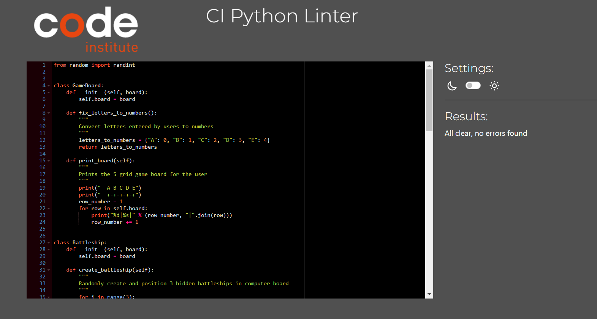

# Battling Ships

Battling Ships is a single player python-based terminal game in which the user guesses the coordinate positions of 3 battleships randomly created by the computer but hidden from the view of the user. To win the game the user must successfully locate these 3 battleships within the maximum 10 turns available.

This is a simple version of the paper board Battleship Game which one can read read about in [Wikipedia](https://en.wikipedia.org/wiki/Battleship_(game))

## How to play the game
The Battling Ships game starts and the user is presented with an empty 5-rows x 5-column players grid board. 

The user is asked to make a guess of the row number and column letter which together make up the coordinate of a targeted ship position.

If the user guesses wrongly it is marked as a "-" on the players board and if the guess is correct it is marked as a "X" on the board.

The user has the 10 possible turn to make 3 correct guesses and if he achieves that the game is won.

### Existing Features
- Creation of 2 game boards
    - A player's guess board which is visible and for the user to input guess data.
    - A computer board which is hidden and contains 3 hidden battleships which the user intends to target.
-  Allows a single user to play against the computer
- The user can pass on input data 
- The user receives useful information regarding the game stutus, for example the turns remaining and mention of targeted ships
- The game offers a user the option of a maximum of 10 turns in which to make a successful guess.
- Validation of the users input data 
    - Row input numbers are checked that they are within the range 1 to 5. If this is not the case the user is asked to repeat this process
    - Column input is checked that it is a letter and that it is within the range A to E. If this is not the case the user is asked to repeat the process.
    - The user's input data is checked so that he does not repeat the same coordinate values. If this happens a notification is displayed

### Future Features
- Allow the user to determine the size of the game board 
- Allow the user to determine the number of hidden ships
## Data Model
For this project I used two classes, the GameBoard class and the Battleship class as models.

The GameBoard class has a constructor which initiates the players board and the hidden computer board for the game. In addition the Gameboard class also has two objects, an object which converts letter values entered by the user to numbers and a print_board method which displays a players board for the user.

The Battleship class has various methods that help to organize the game, a method creates the hidden battleships in the computer board, another method is used to get the guesses made by the user and a method is used to keep check if the user has eliminated all the hidden ships in order to win the game.

## Testing
I did the following manual tests on this project:
- Passed in invalid input values types for required row numbers and column letter coordinates
- Passed in already used input values for row and column coordinates
- Passed codes through Code Institute CI Python Linter without any problems

### Bugs
#### Solved Bugs
- I rewrote part of the syntax to make them shorter in order to eliminate the problem of error: line too long

### Remaining 
- No bugs remaining

### Validator Testing
- CI Python Linter
    - No errors were returned

## Deployment
This project was deployed using Code Institute mock terminal for Heroku.
- Steps for the deployment include:
    - Fork or clone this repository
    - Create Heroku app
    - Set the buildbacks to Python and then NodeJS
    - Link Heroku app to the repository
    - Click the Deploy button

## Credits
- Thanks to [Wikipedia](https://en.wikipedia.org/wiki/Battleship_(game)) for information about the basic rules and structure of the Battleship game
- The [Code Institute](https://codeinstitute.net/de/bildungsgutschein/?utm_term=code%20institute&utm_campaign=CI+-+UK+-+Search+-+Brand&utm_source=adwords&utm_medium=ppc&hsa_acc=8983321581&hsa_cam=16493764737&hsa_grp=132915436926&hsa_ad=635790877672&hsa_src=g&hsa_tgt=kwd-342001843376&hsa_kw=code%20institute&hsa_mt=p&hsa_net=adwords&hsa_ver=3&gclid=EAIaIQobChMIlK3x476__AIVHhkGAB23MAJmEAAYAiAAEgJWRfD_BwE) Love Sandwiches python based project served as general guideline on how to set up and deploy this project
- ULTIMATE Battleships video, the Code Institute scoping example project served as guideline on how to build an object-oriented python project.
- I also used ideas from various versions of how to build a python based Battleship game project from examples in [You Tube](https://www.youtube.com/) and from [Codecademy](http://www.codecademy.com/)
- The code structure and syntax used in this project was significantly inspired from and modelled on the Battleship game example by [Garrett Broughton](https://www.youtube.com/watch?v=alJH_c9t4zw)

